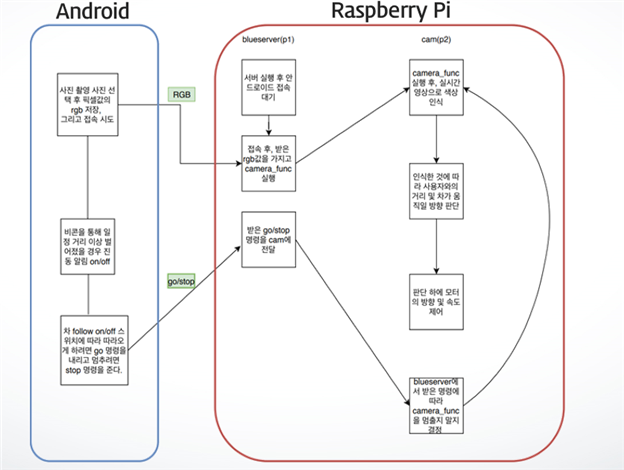
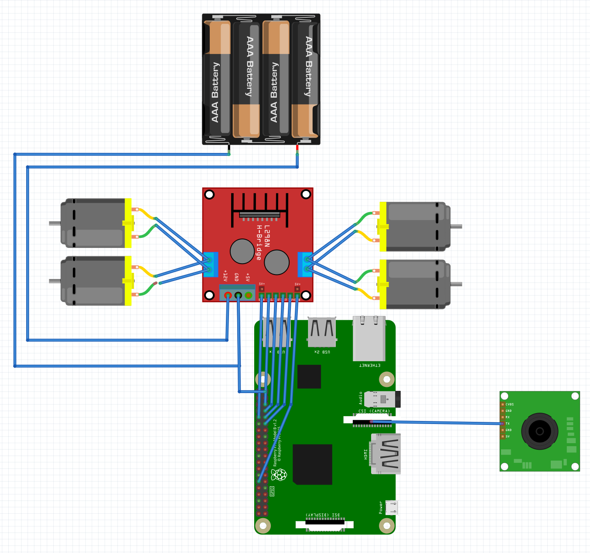

# FollowMeRobot

## 프로젝트 선정 개요

> 외출 시 한 번쯤은 다들 짐이 무거울 때 자신이 직접 들고 다니는 것이 아닌 짐이
든가방이 스스로 자신을 따라다니면 좋겠다는 생각을 해본 적이 있을 것이다. 이
러한 불편을 해소하기 위해서 시중에 나와 있는 대안들도 많지만, 가격이 비싼 경
우가 대다수이다. 그래서 우리는 보다 저렴한 가격으로 형성되어 있는 여러 센서
들로 멀티모달을 설계하고 사용자를 따라오는 로봇을 제작 및 기획하게 되었다.

### 소프트웨어 아키텍처

### 제품 회로도

## 제품 사진

## 사용 기술
개발환경 | Raspbian, Windows 10
---- | ---- |
사용언어 | Java, Python
사용기술 | OpenCV를 이용한 영상인식, 블루투스 소켓 통신
개발도구 | Vim, Android Studio, RaspberryPi 3 Model B, Beacon

## 개발 기간
2019/04 ~ 2019/07/25

## 프로젝트 인원 
4명
